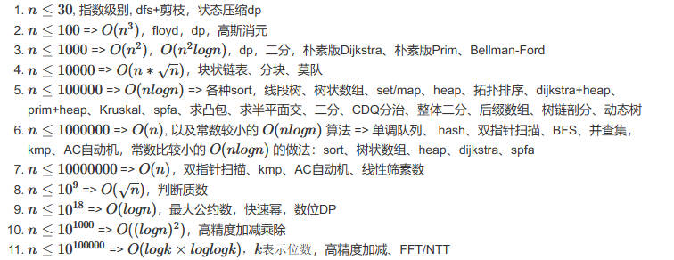

### 由数据范围反推算法复杂度以及算法内容
一般ACM或者笔试题的时间限制是1秒或2秒。
在这种情况下，C++代码中的操作次数控制在 $10^7 \sim 10^8$为最佳。

下面给出在不同数据范围下，代码的时间复杂度和算法该如何选择：

重点：
- 二分、整体二分、前缀和
- dfs
- 状态压缩dp、dp
- 图论：dijkstra+heap、kruskal、floyd
- STL：set、map、heap
- 排序w