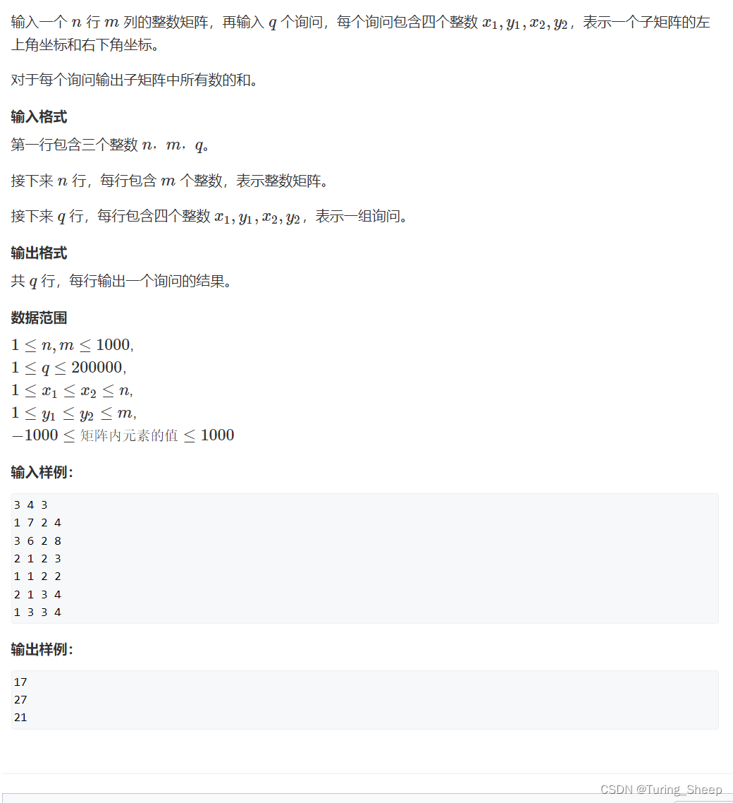

### 前缀和
#### 一维情况
对数列$a_n$, 其前$n$项和为$S_n$。则有
$$a_l + ... + a_r = S_r - S_{l-1}$$
如果我们想求**特定几项$a_n$的和**，那么我们就需要取遍历数组$a_n$，然后才能求出最终的和，我们发现这种情况的时间复杂度是$O(N)$。
但是我们使用前缀和$Sn$去计算的话，我们发现只需要一个简单是式子，其时间复杂度是$O(1)$。
因此在初等数学数列的知识中，前n项和$S_n$的概念，其实是前缀和的一种特殊情况。

一维情况代码实现：
```C++
#include <iostream>
#include <vector>
using namespace std;

int main() {
    int n, m; // n数列长度，m查询次数
    cin >> n >> m;
    vector<int> a(n + 1);
    vector<int> S(n + 1, 0); // 全部值初始化为0

    for (int i = 1; i <= n; i++)
        cin >> a[i]; // 输入数列（vector存储） 

    for (int i = 1; i <= n; i++)
        S[i] = S[i - 1] + a[i]; // 利用定义计算S每一项的值

    while (m--) // 进行查询
    {
        int l, r;
        cin >> l >> r; // 查询数列a中第l项到第r项的和
        cout << S[r] - S[l - 1] << endl;
    }

    return 0;
}


```
#### 二维情况
二维前n项和定义：
$$S(i,j)=S(i-1,j)+S(i,j-1)-S(i-1,j-1)+a(i,j)$$
二维前缀和

蓝色部分覆盖的$a_n$的和
$$S=S(i_2,j_2)-S(i_2,j_1-1)-S(i_1-1,j_2)+S(i_1-1,j_1-1)$$

二维情况代码实现：
```C++
#include <iostream>
using namespace std;

const int N = 1010;
int a[N][N];
int S[N][N];

int main() 
{
    int n, m, q;
    cin >> n >> m >> q;

    for (int i = 1; i <= n; i++) 
    {
        for (int j = 1; j <= m; j++) 
        {
            cin >> a[i][j];
        }
    }

    for (int i = 1; i <= n; i++) 
    {
        for (int j = 1; j <= m; j++) 
        {
            S[i][j] = S[i - 1][j] + S[i][j - 1] - S[i - 1][j - 1] + a[i][j];
        }
    }

    while (q--) 
    {
        int x1, y1, x2, y2;
        cin >> x1 >> y1 >> x2 >> y2;
        cout << S[x2][y2] - S[x2][y1 - 1] - S[x1 - 1][y2] + S[x1 - 1][y1 - 1] << endl;
    }

    return 0;
}

```
### 差分
我们知道前缀和是一个数组中的前$n$项和，其实差分就是原数组$a_n$。
如果我们想**给数列中特定几项都加上一个常数$C$**，那么我们就需要去遍历数组，然后才能找到特定几项进行处理，我们发现这种情况的时间复杂度是$O(N)$。
但是如果我们使用差分$a_n$去计算的话，我们发现只需要一个简单的式子，其时间复杂度是$O(1)$。
#### 一维情况
对数列$a_n$, 其前$n$项和为$S_n$。则有
$$
S_n=\sum^n_{k=1}a_k
$$
$$
a_n=S_n-S_{n-1}
$$

给$S_l  ...  S_r$均加上$C$，可以操作其对应的原数组。
$$a_l =a_l + C, a_{r+1} = a_{r+1} + C $$
这样每次用$a_n$的值去计算得到$S_n$的值，都可以得到操作后的效果。

代码实现
```C++
#include <iostream>
using namespace std;

const int N = 100001;
int S[N];
int a[N];

int main() {
    // 读取数据
    int n, m;
    cin >> n >> m;
    for (int i = 1; i <= n; i++)
        cin >> S[i];
    
    // 构造ai数组: 使得Si是ai的前缀和
    for (int i = 1; i <= n; i++)
        a[i] = S[i] - S[i - 1];
    
    while (m--) {
        // 读取插入的区间和数据
        int l, r, c;
        cin >> l >> r >> c;
        S[l] += c;
        S[r + 1] -= c;
    }
    
    // 利用a数组打印S数组
    for (int i = 1; i <= n; i++)
        cout << (a[i] += a[i - 1]) << " ";
    
    return 0;
}

```