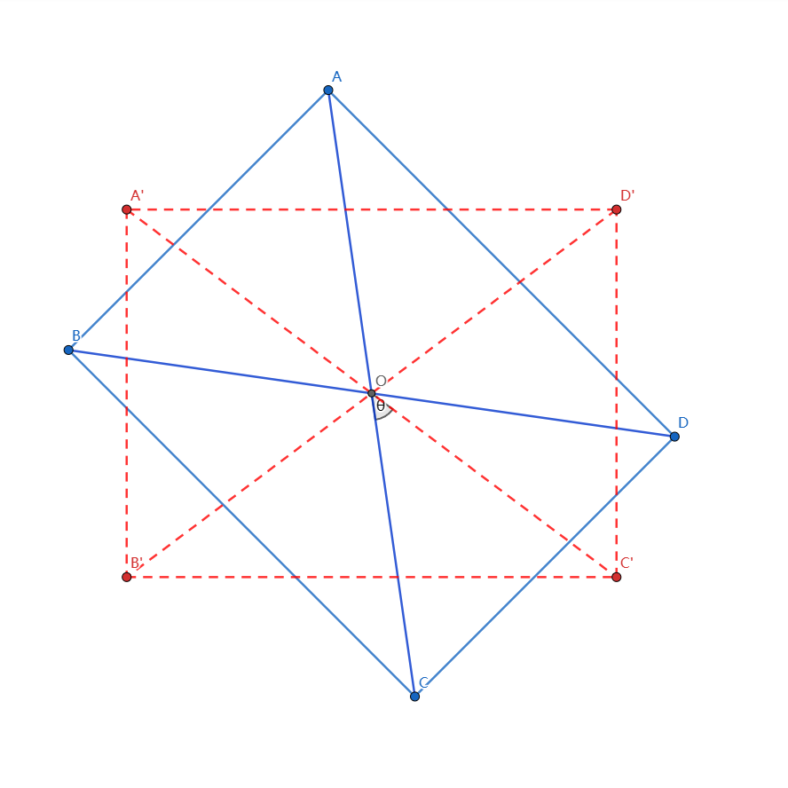
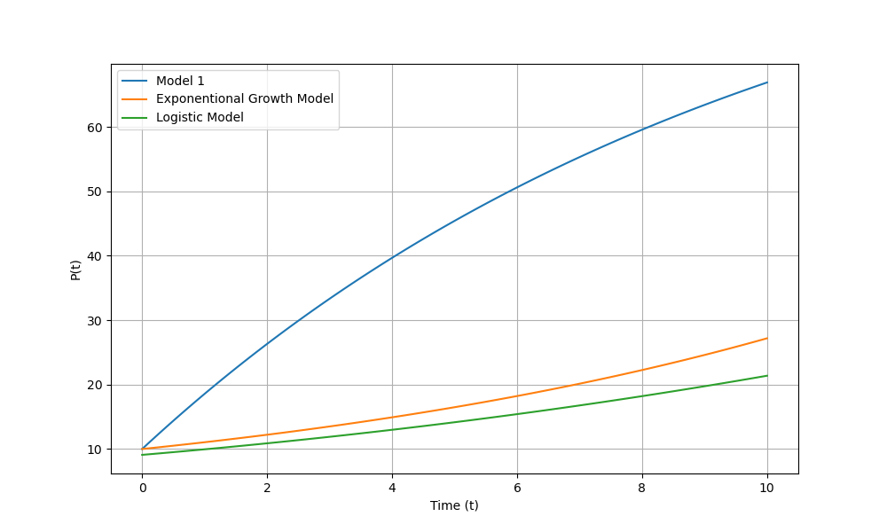

### 在“椅子摆放问题”（可参见课件ppt第1章第3节数学建模简单示例）的假设条件中，将四脚的连线是正方形改为长方形，其余不变，类似构造模型并求解。
#### 1.模型假设
- 椅子腿长度相等，即椅脚与地面接触为点接触，四个脚的连线形成矩形。
- 地面高度的变化是连续的，视为光滑连续曲面。（非台阶类型）
- 在任意位置，椅子至少有三只脚着地。
#### 2.模型建立
##### 2.1 椅子模型建立
椅子与地面的4个接触点分别假设为$A, B, C, D$, 四点形成的矩形对角线交点设为$O$。由于我们假椅子在任一时刻都至少有三只脚着地，只需旋转调整一定的角度就可以实现四只脚着地，现以$O$为旋转中心，旋转角度为$\theta$。如图1。


**<center>图1 </center>**

##### 2.2 摆放模型建立
对某一个椅子脚，若其与地面接触，则认为该椅子脚与地面的距离为0。对于每一个旋转角度$\theta$，每只脚都有一个到地面的距离，即可以认为到地距离是$\theta$的函数。由矩形的对称性，可将四个点到地距离简化为对角线上两点到地距离之和。设$A,C$到地距离之和为$f(\theta)$，$B,D$到地距离之和为$g(\theta)$。若$f(\theta)=g(\theta)=0$，则可以认为椅子四只脚同时着地。
由于地面为光滑连续曲面，$f(\theta),g(\theta)$连续。由于在任意位置，椅子至少有三只脚着地，则
$$\forall \theta, f(\theta)g(\theta)=0$$
若假设在初始状态$(\theta=0)$，
$$g(0)=0, f(0)>0$$
则旋转$\pi$后$(\theta=\pi)$时，对角线互换，
$$f(\pi)=0, g(\pi)>0$$
综上，本问题可等价于以下数学问题：已知$f(\theta),g(\theta)$连续，$\forall \theta, f(\theta)g(\theta)=0$。且$g(0)=0, f(0)>0$，$f(\pi)=0, g(\pi)>0$。证明$\exist \theta_0,$，使得$f(\theta_0)=g(\theta_0)=0$。
#### 3.模型求解
令$h(\theta)=f(\theta)-g(\theta)$，则$h(0)>0, h(\pi)<0$。由零点存在性定理，对于连续函数$h(\theta)$，必然满足
$$\exist \theta_0 \in (0, \pi), h(\theta_0)=0$$
即
$$f(\theta_0)=g(\theta_0)$$
由
$$\forall \theta, f(\theta)g(\theta)=0$$
则
$$f(\theta_0)=g(\theta_0)=0$$
因此在上列假设下,存在这样的旋转角度$\theta_0$使得椅子可以摆放平稳。
### 假定人口的增长服从这样的规律:时刻 $t$ 的人口为$ P\left( t \right) $，$t$到$t+\Delta t$时间内人口的增量与$P^*-P\left( t \right)$成正比（$P^*$为最大人口数）。试建立模型并求解。作出解的图形并与指数增长模型、阻滞增长模型的图形结果进行比较。
#### 1.模型假设
- 人口增长率为常数$r$
- 初始时刻人口$P(0)$设为$p_0$
#### 2.模型建立
由定义，$t到t+\Delta t$时间内人口增量为
$$P(t+\Delta t)-P(t)$$
其与
$$P^*-P(t)$$
成正比例关系，现假设正比例系数为人口增长率$r$
$$P(t+\Delta t)-P(t) = r(P^*-P(t))\Delta t$$
两边同时除以$\Delta t$
$$\frac{P(t+\Delta t)-P(t)}{\Delta t}  = r(P^*-P(t))$$
当$\Delta t\rightarrow 0$，有
$$\frac{P(t+\Delta t)-P(t)}{\Delta t} = \frac{dP(t)}{dt} = r(P^*-P(t))$$
得到微分方程
$$
\begin{cases}
	\frac{dP}{dt} = r(P^*-P)\\
	P(0)=p_0\\
\end{cases}
$$
#### 3.模型求解
上述微分方程的求解结果为
$$P(t)=(P_0-P^*)e^{r(t_0-t)} + P^*$$
通过查阅资料，指数增长模型的微分方程为
$$
\begin{cases}
	\frac{dP}{dt} = rP\\
	P(0)=p_0\\
\end{cases}
$$
求解结果为
$$P(t)=p_0 e^{rt}$$
Logistic模型的微分方程为
$$
\begin{cases}
	\frac{dP}{dt} = rP(1-\frac{P}{P*})\\
	P(0)=p_0\\
\end{cases}
$$
求解结果为
$$P(t)=\frac{P*}{1+(\frac{P*}{p_0})e^{-rt}}$$
作图所用Python代码如下

```Python
import numpy as np
import matplotlib.pyplot as plt

# 定义本题模型
def function1(t, P0, P_star, r, t0):
    return (P0 - P_star) * np.exp(r * (t0 - t)) + P_star

# 定义指数增长模型
def function2(t, P0, r):
    return P0 * np.exp(r * t)

# 定义Logistic模型
def function3(t, P0, P_star, r):
    return P_star / (1 + (P_star / P0) * np.exp(-r * t))

# 生成时间点 t 的值
t_values = np.linspace(0, 10, 100)

# 计算第一个函数的 P(t) 值
P1_values = function1(t_values, P0=10, P_star=100, r=0.1, t0=0)

# 计算第二个函数的 P(t) 值
P2_values = function2(t_values, P0=10, r=0.1)

# 计算第三个函数的 P(t) 值
P3_values = function3(t_values, P0=10, P_star=100, r=0.1)

# 绘图
plt.figure(figsize=(10, 6))

plt.plot(t_values, P1_values, label='Model 1')
plt.plot(t_values, P2_values, label='Exponentional Growth Model')
plt.plot(t_values, P3_values, label='Logistic Model')

plt.xlabel('Time (t)')
plt.ylabel('P(t)')
plt.legend()

plt.grid(True)
plt.show()
```
作图结果如下
