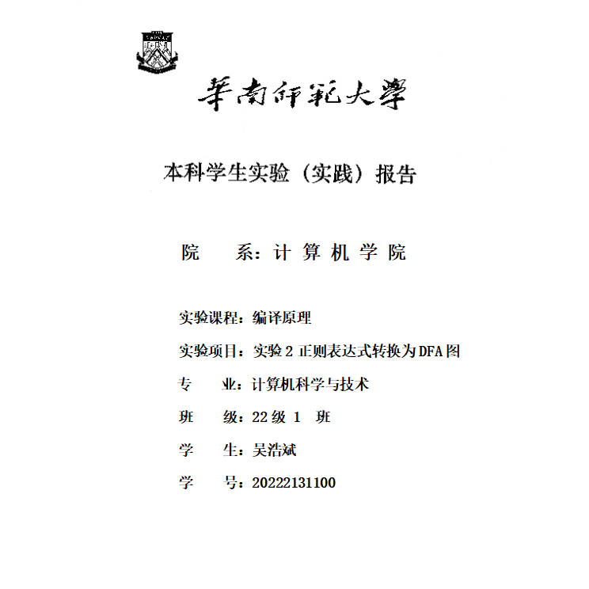

## 一、实验内容
设计一个应用软件，以实现将正则表达式-->NFA--->DFA-->DFA最小化-->词法分析程序(选做内容)

二、必做实验内容及要求：
 （1）正则表达式应该可以支持命名操作，运算符号有： 转义符号`\`、 连接、 选择`|`、  闭包`*`、  正闭包`+`、  `[]`、 可选`?`、 括号`( )`。
 （2）要提供一个源程序编辑界面，让用户输入一行（一个）或多行（多个）正则表达式（可保存、打开正则表达式文件。
 （3）需要提供窗口以便用户可以查看转换得到的NFA（用状态转换表呈现即可）。
 （4）需要提供窗口以便用户可以查看转换得到的DFA（用状态转换表呈现即可）。
 （5）需要提供窗口以便用户可以查看转换得到的最小化DFA（用状态转换表呈现即可）。
 （6）要求应用程序为Windows界面。
 （7）书写完善的软件文档。
## 二、实验目的
做这个实验可以达到以下几个目的：

1. **理解正则表达式的基本概念和运算规则**：通过实践操作，可以更深入地理解正则表达式的语法结构、运算符号以及它们之间的关系，如连接、选择、闭包等。

2. **掌握有限自动机的转换原理**：通过将正则表达式转换成NFA和DFA，并对DFA进行最小化处理，可以加深对有限自动机的理解，掌握其转换原理和算法。

3. **提高编程实现能力**：实现这个应用软件需要学生具备一定的编程能力，包括用户界面设计、正则表达式解析、NFA和DFA的转换算法实现等，这可以帮助提高编程实践能力。

4. **加深对编译原理的理解**：词法分析是编译原理中的重要内容，通过这个实验，可以深入了解词法分析的原理和实现方法，为后续学习编译原理提供扎实的基础。

## 三、实验文档
### 算法思路
-  数据存储结构
- 正则表达式转NFA
1. 正则表达式处理
    - 转义字符
    - 连接运算
    对于所有的连接，都用`.`进行连接。
    - 字符范围`[abc]`可写成`a|b|c`
    - 字符范围`[a-d]`可写成`a|b|c|d`
    - 正闭包`r+`可写成`rr*`
2. NFA机器构造
连接、 选择`|`、  闭包`*`、  正闭包`+`、  可选`?`五种运算需要构造机器，每种运算都需要一个函数，其输入是需要运算的NFA图、输出是运算后的NFA图。下面将以可选运算给出核心算法。
```C++
NFA NFA_optional(NFA nfa_a)
{
    /*---新的初态和末态的定义---*/
    NFAnode *start = new NFAnode();
    NFAnode *end = new NFAnode();

    // 确定初态和末态
    start->isInit = true;
    end->isFinal = true;

    // 新初态和nfa_a的初态进行EPOSILON连接
    NFAedge edge1;
    edge1.type = EPSILON;
    edge1.next = nfa_a.start;
    start->edges.push_back(edge1);
    nfa_a.start->isInit = false;

    // nfa_a的终态和新末态进行EPOSILON连接
    NFAedge edge2;
    edge2.type = EPSILON;
    edge2.next = end;
    nfa_a.end->edges.push_back(edge2);
    nfa_a.end->isFinal = false;

    // 可选运算的实现：新初态和新末态进行EPOSILON连接
    NFAedge edge3;
    edge3.type = EPSILON;
    edge3.next = end;
    start->edges.push_back(edge3);
}
```
核心思想在于：新建NFA结点，进行epsilon连接实现运算，并根据运算的性质更新初态和末态（通常来讲，新建的两个结点就会成为新的初态和末态）。
3. 正则表达式转NFA算法：逆波兰表达式
- NFA转DFA
1. epsilon闭包计算
```C++
// DFS实现epsilon闭包的计算
set<int> epsilonClosure(int id)
{
    set<int> epsilon_closure{id}; // 将id也包括到epsilon_closure,因为一个结点的epsilon闭包也包括本身
    // DFS实现epsilon闭包
    stack<int> stack;
    stack.push(id);
    while (!stack.empty())
    {

        int current = stack.top(); // 在循环中，不断从栈中弹出一个状态 current。
        stack.pop();

        set<int> temp = statusTable[current].state_reachable[EPSILON]; // 对于每个弹出的状态 current，获取其通过ε转移可达的状态集合temp，并遍历这个集合。
        for (auto t : temp)                                            // 对于每个可达状态 t，
            if (epsilon_closure.find(t) == epsilon_closure.end())      // 如果它不在 epsilon_closure 中，就将其加入到 epsilon_closure 中，并将其入栈，以便后续继续搜索
            {
                {
                    epsilon_closure.insert(t);
                    stack.push(t);
                }
            }
    }
    return epsilon_closure;
}
```
核心思想在于：将NFA结构视作图，则每个epsilon闭包就是该结点可以通过权值为epsilon的边到达哪些点，存在一个集合set中（便于去重）。则可以用栈结构实现DFS实现。
2. 非epsilon闭包计算
```C++

```
3. NFA转DFA算法
- DFA最小化
- 状态转换表的记录：DFS


###
## 四、实验总结
## 五、参考文献
